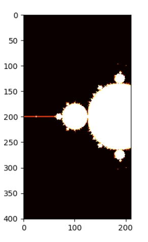

# Mandelbrot Set Generator

The Mandelbrot Set Generator is a Python project that allows users to generate and visualize the intricate and beautiful fractal patterns of the Mandelbrot Set. This project leverages Python's computational and graphical capabilities to render high-resolution images of this fascinating mathematical set.

## 🧠 What is the Mandelbrot Set?

The Mandelbrot Set is a complex and infinitely detailed mathematical object that is defined by iterating a simple equation:  
`z = z² + c` over complex numbers.  
It is known for its stunning fractal boundary and self-similar patterns.

This project renders a portion of the Mandelbrot Set and allows for customization in resolution, zoom, and color.


## Features

- **High-Resolution Visualization:** Generate detailed images of the Mandelbrot Set.
- **Customizable Parameters:** Adjust parameters like the maximum number of iterations and region of interest.
- **Color Mapping:** Visualize the Mandelbrot Set using different color schemes.
- **Save and Export:** Save generated fractal images as PNG files.

## 📁 Project Structure

Mandelbrot-Set-Generator/
├── mandelbrot.py
├── readme_assets/
│ └── Figure_1.jpg
├── README.md
└── requirements.txt (you can add this)

## Requirements

- Python 3.6 or higher
- NumPy
- Matplotlib
- Pillow
## 🚀 How to Run

1. Clone the repository:
   ```bash
   git clone https://github.com/hamzyas53/Mandelbrot-Set-Generator.git
   cd Mandelbrot-Set-Generator
2. Install the required libraries:

pip install numpy matplotlib pillow

3. Run the script:

python mandelbrot.py

## 🙌 Credits

Created by Dhairya Choudhry and Hamza Yaseen.  
Modified and maintained version by Hamza Yaseen.


<br/>

